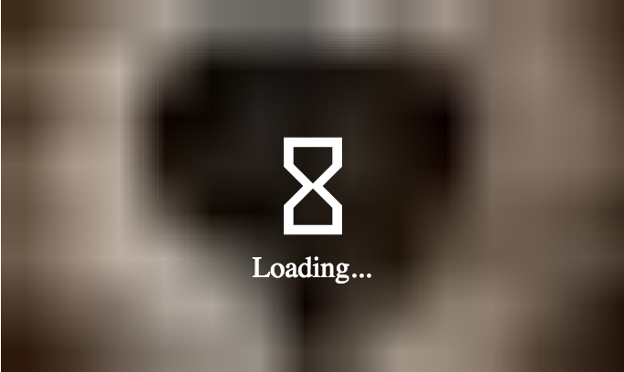
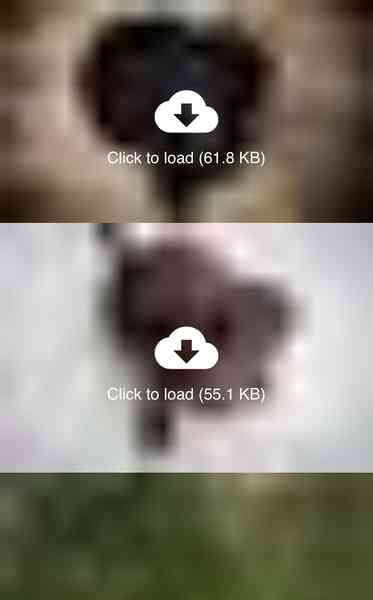

# An Almost Ideal React Image Component

TL;DR. This started as an exercise - how to build ideal React image component. The focus was more on UX and browser capabilities, rather than React code. I created react component and published it to npm, but it has no tests and not battle tested in the wild, use it at your own risk.

[Online example](https://stereobooster.github.io/react-ideal-image-experiments/) | [HN discussion](https://news.ycombinator.com/item?id=17210378) | [Guide To Async Components](https://github.com/stereobooster/guide-to-async-components)

## Lazy loading

This is a straightforward feature - do not load images which are outside of the screen. Do not need to reinvent a wheel, there is [react-waypoint](https://github.com/brigade/react-waypoint), to trigger actions in the component as soon as it appears on the screen (pseudo code):

```js
<Waypoint onEnter={() => this.setState({src})}>
  
</Waypoint>
```

<table>
  <tr>
    <td>
      <b>Pic 1.</b> Browser's `img` loads all 5 images on the page, but only 3 are visible
      
    </td>
    <td rowspan="2">
      <b>Pic 3.</b> Screenshot of the page
      
    </td>
  </tr>
  <tr>
    <td>
      <b>Pic 2.</b> "Lazy-load" loads only 3 visible images
      
    </td>
  </tr>
</table>

## Placeholder

As soon as you start to do lazy loading you will notice unpleasant content jumps as soon as images get loaded. This is bad for two reasons: UX - content jumps make user loose visual track, performance - content jumps are [browser redraws](https://developers.google.com/speed/docs/insights/browser-reflow). This is why we need a placeholder - a thing which will fill place until the image gets loaded. To do this we need to know image size upfront. AMP has same requirements for all blocks. Simplest placeholder(pseudo code):

```js
load () {
  const img = new Image()
  img.onload = () => this.setState({loaded:true})
  img.src = this.props.src
}
render() {
  if (!this.state.loaded) {
    return (<svg width={this.props.width} height={this.props.height} />)
  } else {
    return ()
   }
}
```

**Pic 4.** Load progress of images without dimension


### LQIP

Better, but not ideal. A user will see blank space until image load, this can be perceived as broken functionality - what if the image fails to load, what if it takes too long. Low-Quality Image Placeholder to the rescue. This technique is known since times of progressive JPEGs, later forgotten and reinvented by Facebook, Medium, and others. Also, we can use solid color placeholder or SQIP. Read more about placeholders [here](https://medium.freecodecamp.org/using-svg-as-placeholders-more-image-loading-techniques-bed1b810ab2c). To get LQIP you can use [sharp](https://github.com/lovell/sharp)

```js
const getLqip = file =>
  new Promise((resolve, reject) => {
    sharp(file)
      .resize(20)
      .toBuffer((err, data, info) => {
        if (err) return reject(err)
        const {format} = info
        return resolve(`data:image/${format};base64,${data.toString('base64')}`)
      })
  })

const lqip = await getLqip('cute-dog.jpg')
```

Also check: [lqip](https://github.com/zouhir/lqip) or [lqip.macro](https://github.com/stereobooster/lqip.macro); [sqip](https://github.com/technopagan/sqip) or [sqip.macro](https://github.com/stereobooster/sqip.macro);

Use LQIP like this (pseudo code):

```js
<div style={{background: `no-repeat cover url("${this.props.lqip}")`}}>
  <svg width={this.props.width} height={this.props.height} />
</div>
```

Or in the component:

```js
<IdealImage width={100} height={100} placeholder={{lqip: ''}} />
```

**Pic 5.** Load progress of images with LQIP, but without JS


**Pic 6.** Load progress of images with LQIP and with JS


## Responsive

### Styles

We are specifying exact width and height of the image and the placeholder. To make it responsive we need to add some CSS (pseudo code):

```js
const img = {
  width: '100%',
  height: 'auto',
  maxWidth: '100%',
}

render() {
  if (this.state.loaded) {
    return (<svg style={img} width={this.props.width} height={this.props.height} />)
  } else {
    return ()
   }
}
```

### `srcset`

This feature is about reimplementing `srcset` property of [responsive image](https://css-tricks.com/responsive-images-youre-just-changing-resolutions-use-srcset/). It would be nice to use image based on the size of the screen, to minimize traffic for the images on small devices.

To do this we will need:

- Set of images resized for different devices. You can use sharp to resize images.
- Data about how much space image takes on the screen. This is easy because we mount placeholder before the image, so the reference to the placeholder can be used to get dimensions
- Some heuristic based on `screen.width`, `screen.height`, `window.devicePixelRatio`, `body.clientHeight` to guess maximum image size for given device
- Would be nice to take into account `orientationchange` events, but will not do this for now.

See exact implementation in the code (`guessMaxImageWidth`). Our component will look like this:

```js
<IdealImage
  width={100}
  height={100}
  placeholder={{lqip: ''}}
  {...props}
  srcset={[
    {width: 100, src: 'cute-dog-100.jpg'},
    {width: 200, src: 'cute-dog-200.jpg'},
  ]}
/>
```

Also possible to reimplement `sizes` param with [css-mediaquery](https://github.com/ericf/css-mediaquery), but this potentially can give more bugs than the actual value.

## Adaptive

Most likely you haven't heard this term applied to the images, because I made it up. Adaptive image - an image which adapts to the environment, for example, if the browser supports WebP use it if the network to slow stop auto download images if the browser is offline communicate to the user that download of the image is not possible at the moment.

### WebP

To detect WebP support we can use this snippet copy-pasted from StackOverflow:

```js
const detectWebpSupport = () => {
  if (ssr) return false
  const elem = document.createElement('canvas')
  if (elem.getContext && elem.getContext('2d')) {
    // was able or not to get WebP representation
    return elem.toDataURL('image/webp').indexOf('data:image/webp') === 0
  } else {
    // very old browser like IE 8, canvas not supported
    return false
  }
}
```

Use component like this:

```js
<IdealImage
  {...props}
  srcset={[
    {width: 100, src: 'cute-dog-100.jpg'},
    {width: 100, src: 'cute-dog-100.webp'},
  ]}
/>
```

### Slow network

If the network is slow it makes no sense to auto-download image (as soon as it appears on the screen), because it will take a long time to load even more time if the browser tries to download more than one image simultaneously.

Instead, we can let the user decide if they want to download image or not. There should be an icon over placeholder, so the user can click it to start the download, and click again to cancel the download. As soon as the download starts there should be no icon, but if it takes to long some indicator of loading state should appear to inform the user that it is still working.

| load                             | no icon                            | loading                             |
| -------------------------------- | ---------------------------------- | ----------------------------------- |
|  |  |  |

In Chrome it is pretty easy to detect the slow network with `navigator.connection.effectiveType`. If it is 'slow-2g', '2g', '3g' then the component will not auto-download images.

| Component detected slow network and didn't try to load images  | Component switched to manual mode  |
| :---------------------------------------------------------------------------------------------------------------- | :--------------------------------------------------------------------------------- |


For other browsers, we can try to guess if the download of the image takes too much time. How much time should be considered as too much is up-to developer, via `threshold` property (optional):

```js
<IdealImage {...props} threshold={1000 /* ms */} />
```

If image takes to long to download and the load was initiated by "Lazy loading" feature then:

- load process will be canceled
- the component will show control, so the user can initiate the download of the image manually
- the component will broadcast event `possibly slow network`, so other components would not even try load images and will be switched to "Manual mode"

| Component tried to download images, but canceled load after 1 second  | Component switched to manual mode  |
| :---------------------------------------------------------------------------------------------------------------------------- | :-------------------------------------------------------------------------------------- |


### Cancel download

In Chrome (and probably other browsers) you can asign empty string to `src` to cancel download, but this doesn't work in Mobile Safari:

```js
const img = new Image()
//...
img.src = ''
```

Other way to do it is to use good old `XMLHttpRequest` which supports cancel:

```js
const request = new XMLHttpRequest()
//...
request.abort()
```

Buuut:

- if images are uncacheable this will not work - the browser will trigger another request for the image as soon as we insert an image in the DOM
- if images are hosted on the different domain we will need to configure CORS properly

This is why I chose to let developer decide which approach to use (default is `xhr`):

```js
<IdealImage {...props} loader="image" />
```

It is also possible to use `fetch` with [`AbortController`](https://developer.mozilla.org/en-US/docs/Web/API/AbortController), but it is supported only in Chrome 66+ at the moment.

## More UX

### Network error

If image network request errored we need to show user message that browser failed to download the image. The user should be able to recover from the error (in case of temporal issue), by clicking on the image user can trigger repetitive load.

### 404 error

404 error is the special one. We use LQIP placeholder, which creates "impression" of content, but our component can outlive real image. We need clearly explain to the user that image doesn't exist anymore.

### Offline

Because we are lazy loading images, it can happen that we have some unloaded images at the moment when the browser goes offline. We should not confuse users in this case with an error message, instead we should clearly identify that browser is offline and this is why browser cannot load images.

| Network error                     | 404 error                             | Offline                             |
| --------------------------------- | ------------------------------------- | ----------------------------------- |
|  |  |  |

## SSR or prerendering

On the server, the component will be rendered with a placeholder (lqip) and without an icon. As soon as React application will boot, the component will decide if it needs to start download image or show download icon.

### Users with disabled JavaScript

For users with disabled JavaScript or for search bots component will render the good old image in `<noscript>` tag:

```js
<noscript>
  
</noscript>
```

## Customization

### Icons

By default, the component uses icons from material design, implemented as React components with the SVG element. You can customize icons

```js
const icons = {
  load: DownloadIcon,
  //...
}

return <IdealImage {...props} icons={icons} iconColor="#fff" iconSize={64} />
```

### Theme

By default, the component uses inline styles, but it is also possible to use CCS modules and override all styles

```js
const theme = {
  adaptive: {
    backgroundSize: 'cover',
    backgroundRepeat: 'no-repeat',
    position: 'relative',
  },
  // ...
}

return <IdealImage {...props} theme={theme} />
```

or with CSS modules

```js
import theme from './theme.module.css'

return <IdealImage {...props} theme={theme} />
```

### i18n

As of now, the solution is primitive - you can pass a function which generates messages

```js
const getMessage = (icon, state) => {
  switch (icon) {
    case 'loading':
      return 'Loading...'
    //...
  }
}

return <IdealImage {...props} getMessage={getMessage} />
```

Need to improve this

## To be continued

What is missing:

- tests
- proper handling of properties update
- there seems a bug with setTimeout when the browser window is inactive
- the code doesn't take into account change of the screen size because of the device rotation

If you want to give it a try:

```
npm install react-ideal-image react-waypoint --save
```
